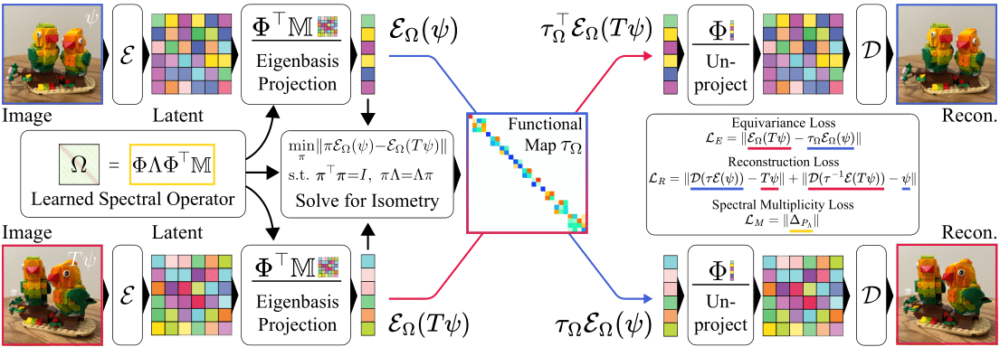

# Neural Isometries



This is the official implementation for **Neural Isometries: Taming Transformations for Equivariant ML** by Thomas W. Mitchel, Michael Taylor, and Vincent Sitzmann.

Check out the paper [here](https://arxiv.org/abs/2405.19296).

This code base is implemented in JAX. An official PyTorch implementation is forthcoming.

## Installation

To get started on Linux, create a Python virtual environment:

```bash
python3 -m venv niso
source niso/bin/activate
pip install -r requirements.txt
```

**Warning:** `jax` and `jaxlib` versions `v0.4.29` through `v0.4.31` appear to contain a catastrophic floating point (?) bug that prevents NIso from training and evaluating correctly. Please ensure that your `jax` and `jaxlib` versions are `<= v0.4.28` or `>= v0.4.32`. 


## Experiments

Code to run the experiments in the paper can be found in the `experiments` directory. Training data and visualizations are logged via `wandb`. Make sure to activate the virtual enviorment before running.

### Approximating the Toric Laplacian
To run the experiment, execute 
```
python3 train.py --out "/path/to/directory/where/model/weights/will/be/stored/"
```
in the `experiments/laplacian` directory.

### Homography-Perturbed MNIST
Download the HMNIST evaluation set `.mat` file from [here](https://www.kaggle.com/datasets/lachlanemacdonald/homnist). 

To pre-train the NIso backbone, move to the `experiments/hmnist_encode` directory and execute
```
python3 train.py --out "/path/to/hmnist_encode/weights/"
```
The autoencoder weights will be saved to `/path/to/hmnist_encode/weights/exp_num/checkpoints-0/` where `exp_num` increments with each run. 


Afterwards, train and evaluate the classification network by running 
```
python3 train.py --in "/path/to/homNIST_test.mat" --weights "/path/to/hmnist_encode/weights/exp_num/checkpoints-0/" --out "/path/to/hmnist_pred/weights/"
```
in the `experiments/hmnist_pred` directory.

### Conformal Shape Classification
Download and unzip the [Conformal SHREC'11 Shape Classification Dataset](https://www.dropbox.com/scl/fi/nofmj3nfdzxm4uwhumo75/SHREC_11_CONF.zip?rlkey=3qst50619xg31bzax6jqzf3cm&st=r2qzzjbg&dl=0). 

Afterwards, pre-process and save the dataset as `.tfrecords` files by running the `process_cshrec11.py` script in the `/data/` directory. Before doing so, set the `DATA_DIR` variable on line 47 to the directory continaing the unzipped dataset. Similarly, set the`PROCESSED_DIR` variable on line 49 to the directory where the output `.tfrecords` files will be saved. 

To pre-train the NIso backbone, move to the `experiments/cshrec11_encode` directory and execute
```
python3 train.py --in "/path/to/cshrec11/tfrecords/files/" --out "/path/to/cshrec11_encode/weights/"
```
The autoencoder weights will be saved to `/path/to/cshrec11_encode/weights/exp_num/checkpoints-0/` where `exp_num` increments with each run. 


Afterwards, train and evaluate the classification network by running 
```
python3 train.py --in "/path/to/cshrec11/tfrecords/files/" --weights "/path/to/cshrec11_encode/weights/exp_num/checkpoints-0/" --out "/path/to/cshrec11_pred/weights/
```
in the `experiments/cshrec11_pred` directory.

### Camera Pose Estimation from Real-World Video
Download and extract the CO3DV2 dataset by following the instructions on the [website](https://github.com/facebookresearch/co3d). The dataset is large (several TB) so make sure you have enough space. Note that we only use the top 25% of sequences as indexed by their pose quality score. The list of these sequences can be found in the `co3dv2_top25_splits.json` file in the `/data` directory.

Afterwards, pre-process and save the dataset as `.tfrecords` files by running the `process_co3d.py` script in the `/data/` directory. Before doing so, set the `DATA_DIR` variable on line 35 to the directory continaing the unzipped dataset. Similarly, set the`PROCESSED_DIR` variable on line 36 to the directory where the output `.tfrecords` files will be saved. 

To pre-train the NIso backbone, move to the `experiments/pose_encode` directory and execute
```
python3 train.py --in "/path/to/co3dv2/tfrecords/files/" --out "/path/to/pose_encode/weights/"
```
The autoencoder weights will be saved to `/path/to/pose_encode/weights/exp_num/checkpoints-0/` where `exp_num` increments with each run. 


Afterwards, train and evaluate the pose prediction network by running 
```
python3 train.py --in "/path/to/co3dv2/tfrecords/files/" --weights "/path/to/pose_encode/weights/exp_num/checkpoints-0/" --out "/path/to/pose_pred/weights/"
```
in the `experiments/pose_pred` directory.


## BibTeX

```bibtex
@misc{mitchel2024neuralisometriestamingtransformations,
      title={Neural Isometries: Taming Transformations for Equivariant ML}, 
      author={Thomas W. Mitchel and Michael Taylor and Vincent Sitzmann},
      year={2024},
      eprint={2405.19296},
      archivePrefix={arXiv},
      primaryClass={cs.CV},
      url={https://arxiv.org/abs/2405.19296}, 
}
```
